# OS | Lab 1 | Tupichenko Mila | P3309

## Задание 1

Необходимо реализовать собственную оболочку командной строки - shell. Выбор ОС для реализации производится на усмотрение студента. Shell должен предоставлять пользователю возможность запускать программы на компьютере с переданными аргументами командной строки и после завершения программы показывать реальное время ее работы (подсчитать самостоятельно как «время завершения» – «время запуска»).

## Задание 2

Разработать комплекс программ-нагрузчиков по варианту, заданному преподавателем. Каждый нагрузчик должен, как минимум, принимать параметр, который определяет количество повторений для алгоритма, указанного в задании. Программы должны нагружать вычислительную систему, дисковую подсистему или обе подсистемы сразу. Необходимо скомпилировать их без опций оптимизации компилятора.

Перед запуском нагрузчика, попробуйте оценить время работы вашей программы или ее результаты (если по варианту вам досталось измерение чего либо). Постарайтесь обосновать свои предположения. Предположение можно сделать, основываясь на свой опыт, знания ОС и характеристики используемого аппаратного обеспечения.

1. Запустите программу-нагрузчик и зафиксируйте метрики ее работы с помощью инструментов для профилирования. Сравните полученные результаты с ожидаемыми. Постарайтесь найти объяснение наблюдаемому.
2. Определите количество нагрузчиков, которое эффективно нагружает все ядра процессора на вашей системе. Как распределяются времена  USER%, SYS%, WAIT%, а также реальное время выполнения нагрузчика, какое количество переключений контекста (вынужденных и невынужденных) происходит при этом?
3. Увеличьте количество нагрузчиков вдвое, втрое, вчетверо. Как изменились времена, указанные на предыдущем шаге? Как ведет себя ваша система?
4. Объедините программы-нагрузчики в одну, реализованную при помощи потоков выполнения, чтобы один нагрузчик эффективно нагружал все ядра вашей системы. Как изменились времена для того же объема вычислений? Запустите одну, две, три таких программы.
5. обавьте опции агрессивной оптимизации для компилятора. Как изменились времена? На сколько сократилось реальное время исполнения программы нагрузчика?

## Выполнение задания 1

### Функция выполнения команды

```c
BOOL Execute(TCHAR *commandLine) {
  // Handle for the current process token
  HANDLE hToken = NULL;
  // Structures for process creation
  STARTUPINFO si;
  PROCESS_INFORMATION pi;

  // Required access rights for creating a process with a token
  DWORD desiredAccess = TOKEN_DUPLICATE | TOKEN_ASSIGN_PRIMARY | TOKEN_QUERY |
                        TOKEN_ADJUST_DEFAULT | TOKEN_ADJUST_SESSIONID;

  // Get the token of the current process
  if (!OpenProcessToken(GetCurrentProcess(), desiredAccess, &hToken)) {
    return FALSE;
  }

  // Initialize the STARTUPINFO structure
  ZeroMemory(&si, sizeof(STARTUPINFO));
  si.cb = sizeof(STARTUPINFO);
  // Specify the desktop where the process will run
  si.lpDesktop = _T("winsta0\\default");

  // Create a new process under the user context specified by the token
  if (!CreateProcessAsUser(hToken, // Token handle for the user context
                           NULL,   // Application name (NULL uses command line)
                           commandLine, // Command line string
                           NULL,        // Process security attributes
                           NULL,        // Thread security attributes
                           FALSE,       // Inherit handles flag
                           0,           // Creation flags
                           NULL,        // Environment block
                           NULL,        // Current directory
                           &si,         // Startup info
                           &pi          // Process information
                           )) {
    CloseHandle(hToken);
    return FALSE;
  }

  // Wait for the created process to complete
  WaitForSingleObject(pi.hProcess, INFINITE);

  // Clean up handles
  CloseHandle(pi.hProcess);
  CloseHandle(pi.hThread);
  CloseHandle(hToken);

  return TRUE;
}
```

### Функция вывода времени работы программы

```c
DWORDLONG MeasureProcessTime(TCHAR *commandLine) {
  LARGE_INTEGER start, end;
  LARGE_INTEGER frequency;
  double elapsedTime;

  QueryPerformanceFrequency(&frequency);
  QueryPerformanceCounter(&start);

  if (!Execute(commandLine)) {
    return EXECUTION_ERROR;
  }

  QueryPerformanceCounter(&end);

  elapsedTime =
      ((double)(end.QuadPart - start.QuadPart) / frequency.QuadPart) * 1e+9;

  return (DWORDLONG)elapsedTime;
}
```

### Основная функция оболочки

1. Запрос строки команды у пользователя.
2. Если команда пуста или является "exit", оболочка завершает свою работу.
3. Если команда введена корректно, вызывается Execute(), и время выполнения измеряется.
4. Если выполнение прошло успешно, выводится время в секундах.
5. Если команда не была выполнена, выводится сообщение об ошибке.

```c
VOID RunShell(void) {
  TCHAR commandLine[MAX_PATH];
  DWORDLONG executionTime;

  while (TRUE) {
    _tprintf(_T("shell> "));
    if (_fgetts(commandLine, MAX_PATH, stdin) == NULL) {
      _tprintf(_T("\033[31mError reading command\033[0m\n"));
      continue;
    }

    size_t len = _tcslen(commandLine);
    if (len > 0 && commandLine[len - 1] == _T('\n')) {
      commandLine[len - 1] = _T('\0');
    }

    if (_tcscmp(commandLine, _T("exit")) == 0) {
      break;
    }

    if (_tcscmp(commandLine, _T("\0")) == 0) {
      _tprintf(_T("\033[31mNo command entered\033[0m\n"));
      continue;
    }

    executionTime = MeasureProcessTime(commandLine);
    if (executionTime == EXECUTION_ERROR) {
      _tprintf(_T("\033[31mFailed to execute command\033[0m\n"));
    } else {
      _tprintf(_T("\033[32mExecution time: %fs\033[0m\n"),
               executionTime / 1e+9);
    }
  }

  return;
}
```

### Пример выполнения

```shell
shell> help
...
WMIC           Отображает сведения об инструментарии WMI в интерактивной командной оболочке.

Дополнительные сведения о средствах см. в описании программ командной строки в справке.
Execution time: 0.026294s
shell> ls
Failed to execute command
shell> wsl

AppData/Roaming/Telegram Desktop
❯ exit
Execution time: 5.100294s
shell> explorer.exe
Execution time: 0.381981s
shell> notepad.exe
Execution time: 0.796403s
shell> cmd.exe
Microsoft Windows [Version 10.0.22631.4602]
(c) Корпорация Майкрософт (Microsoft Corporation). Все права защищены.
```

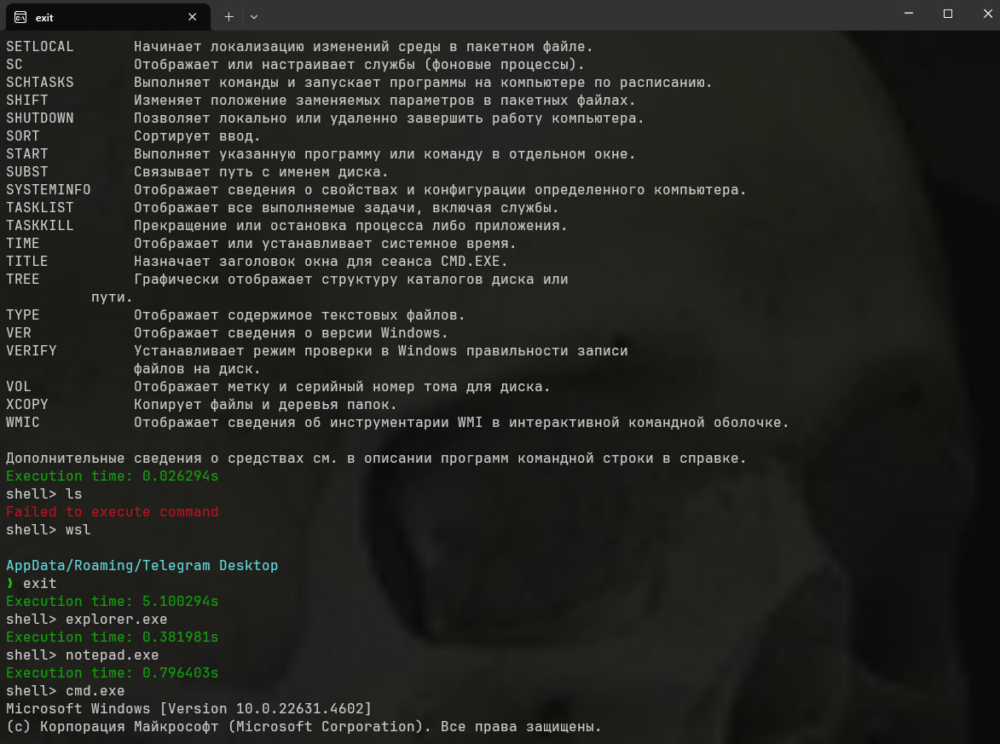

## Выполнение задания 2

### Предварительная оценка

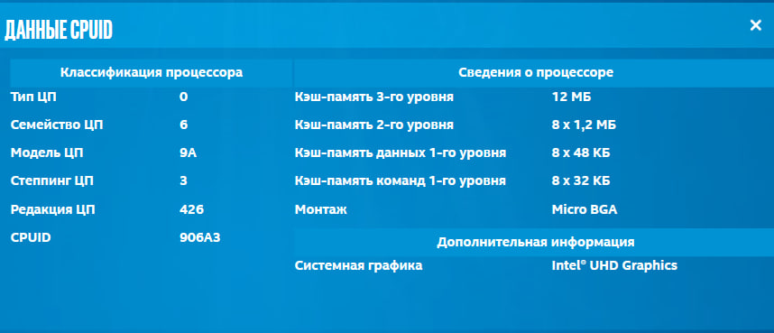

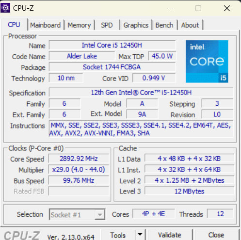

### Наугрузчик №1 (deduplicate)

```c
int *Deduplicate(int *array, size_t *length) {
  int *deduplicated = (int *)malloc(*length * sizeof(int));
  if (deduplicated == NULL) {
    return NULL;
  }

  size_t deduplicatedLength = 0;

  for (size_t i = 0; i < *length; i++) {
    size_t j;
    for (j = 0; j < deduplicatedLength; j++) {
      if (array[i] == deduplicated[j]) {
        break;
      }
    }

    if (j == deduplicatedLength) {
      deduplicated[deduplicatedLength] = array[i];
      deduplicatedLength++;
    }
  }

  *length = deduplicatedLength;

  return deduplicated;
}
```
```c
bool RunDeduplicateBenchmark(size_t iterations, size_t threads) {
  if (threads > MAX_THREADS)
    threads = MAX_THREADS;

  HANDLE handles[MAX_THREADS];
  ThreadParams params[MAX_THREADS];

  for (size_t i = 0; i < threads; i++) {
    params[i].iterations = iterations / threads;
    params[i].thread_id = i;
    handles[i] = CreateThread(NULL, 0, DeduplicateWorker, &params[i], 0, NULL);
  }

  WaitForMultipleObjects(threads, handles, TRUE, INFINITE);

  for (size_t i = 0; i < threads; i++) {
    CloseHandle(handles[i]);
  }

  return true;
}
```

### Оценка алгоритма

1. Время: O(n^3)
2. Память: O(n)


### Запуск без оптимизации

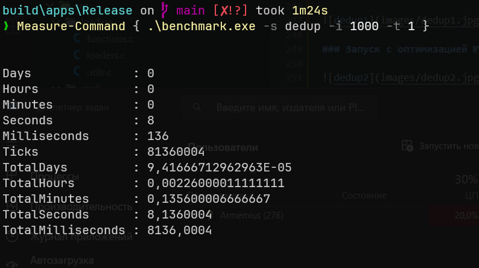

### Запуск с оптимизацией №1

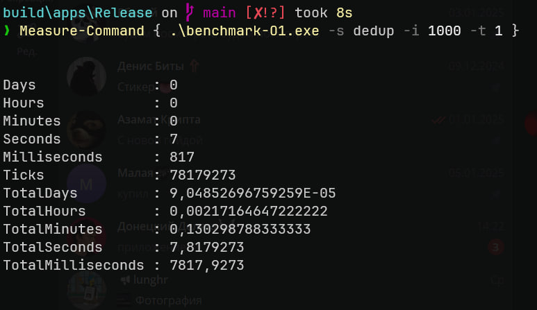

### Запуск с оптимизацией №2

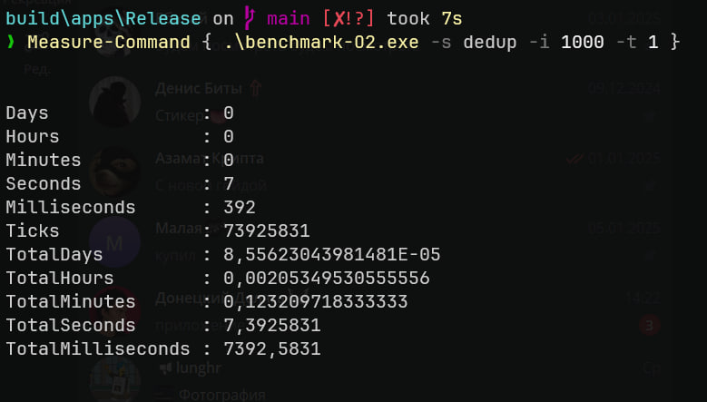

### Запуск с оптимизацией №3

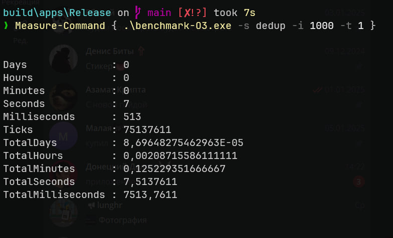


### Профилирование количества нагрузчиков и их влияние на загруженность ядер

#### 1 загрузчик

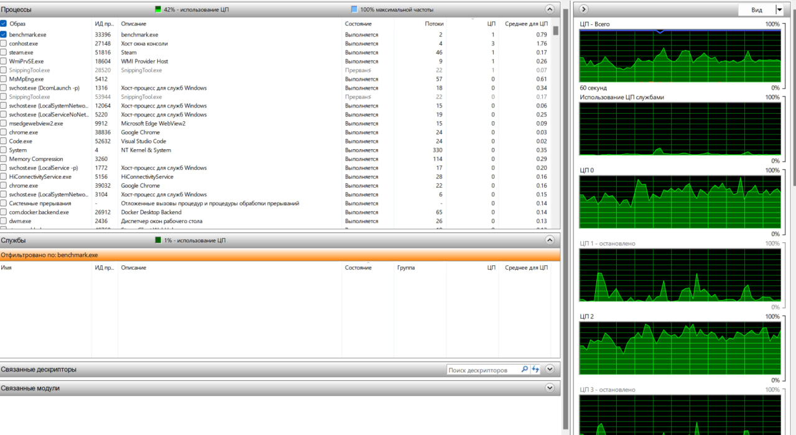

#### 2 загрузчика

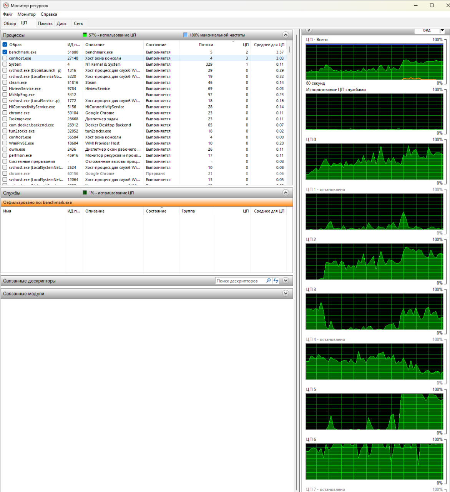

#### 4 загрузчика

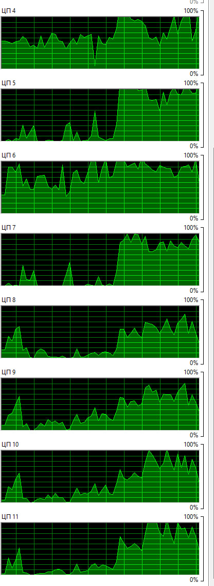

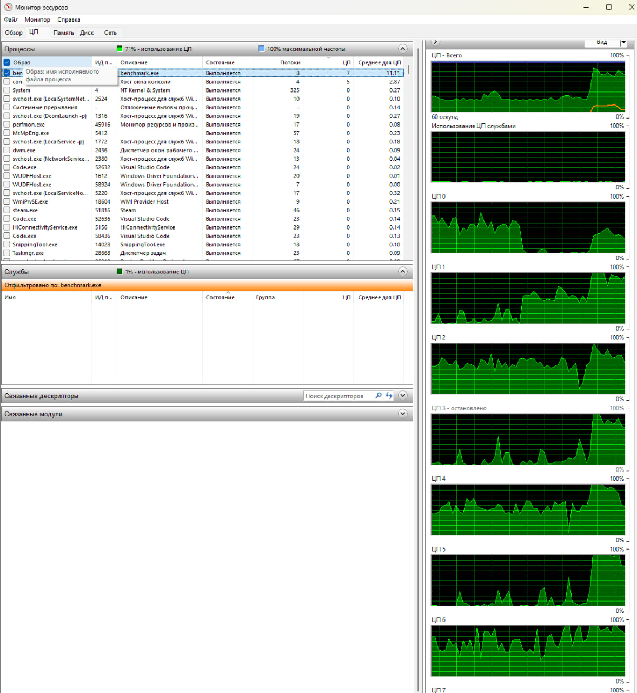

#### 8 загрузчиков

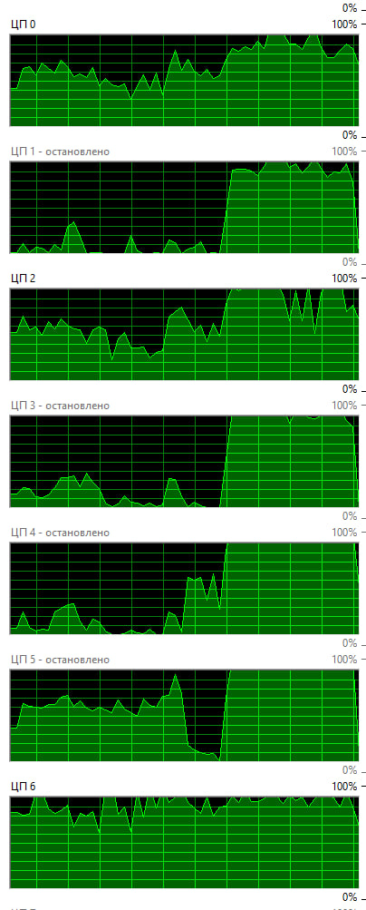

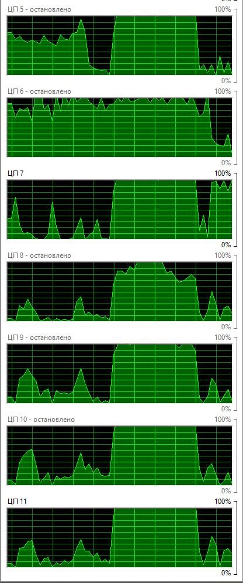

#### 10 загрузчиков

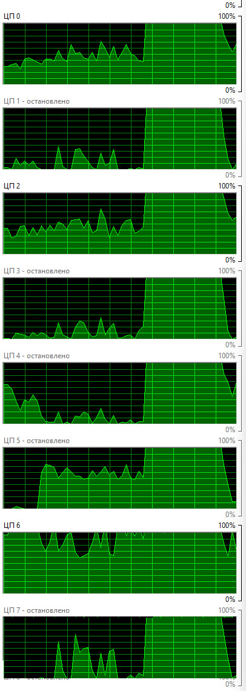

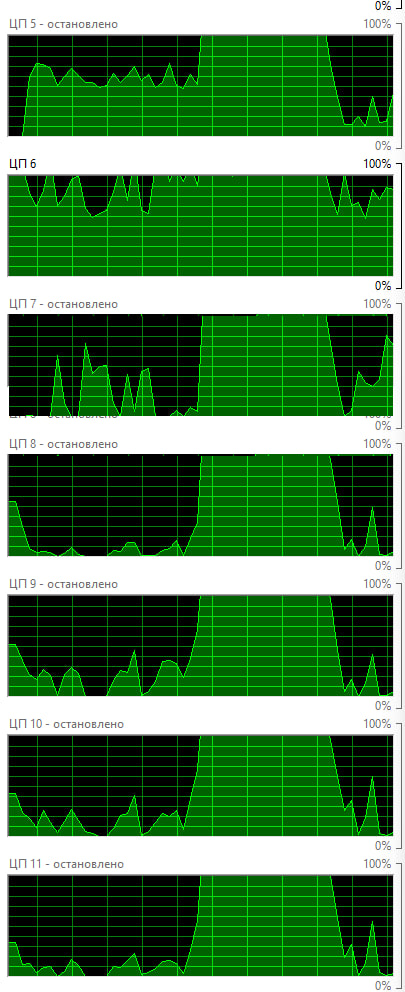

---

При 10 загрузчиках пользователь занимат 95-98% цп, а система оставшиеся 5-10%, поэтому дальше грузить систему не хотелось

---

Выводы будут потом


###  Наугрузчик №2 (io-thpt-read)

```c
   double IoThtpRead(const char *filename) {
  FILE *file = fopen(filename, "r");
  if (file == NULL) {
    return -1;
  }

  char buffer[4096];
  size_t bytesRead;
  size_t totalBytesRead = 0;

  while ((bytesRead = fread(buffer, 1, sizeof(buffer), file)) > 0) {
    totalBytesRead += bytesRead;
  }

  fclose(file);

  return (double)totalBytesRead;
}
```

```c
bool RunIoThtpReadBenchmark(size_t iterations, size_t threads) {
  if (threads > MAX_THREADS)
    threads = MAX_THREADS;

  CreateFile("iotest.dat", FILE_SIZE);

  HANDLE handles[MAX_THREADS];
  ThreadParams params[MAX_THREADS];

  for (size_t i = 0; i < threads; i++) {
    params[i].iterations = iterations / threads;
    params[i].thread_id = i;
    handles[i] = CreateThread(NULL, 0, IoThtpReadWorker, &params[i], 0, NULL);
  }

  WaitForMultipleObjects(threads, handles, TRUE, INFINITE);

  for (size_t i = 0; i < threads; i++) {
    CloseHandle(handles[i]);
  }

  DeleteFile("iotest.dat");
  return true;
}
```
### Оценка алгоритма

1. Время: O(n)
2. Память: O(1)

### Запуск без оптимизации

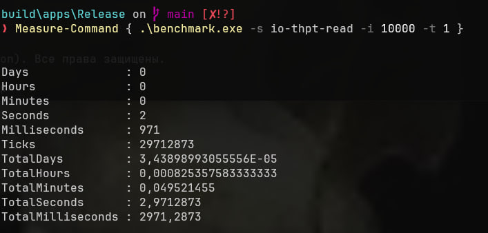

### Запуск с оптимизацией №1

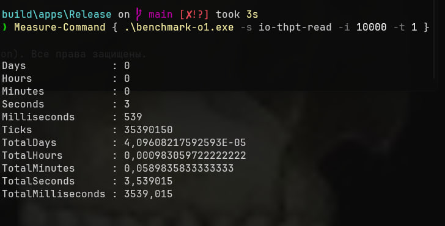

### Запуск с оптимизацией №2

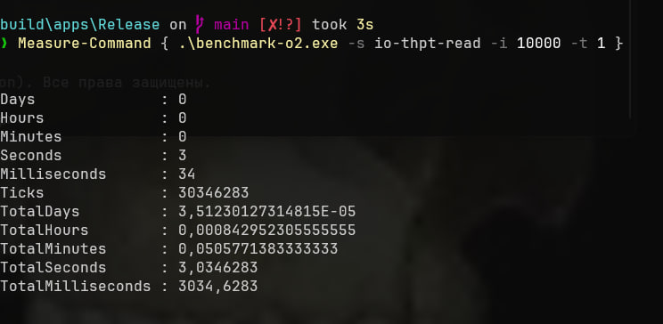

### Запуск с оптимизацией №3

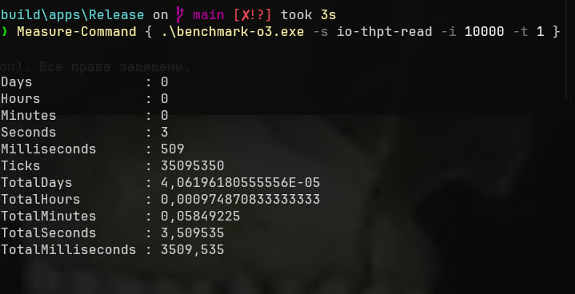

### Профилирование количества нагрузчиков и их влияние на загруженность ядер

#### 1 загрузчик

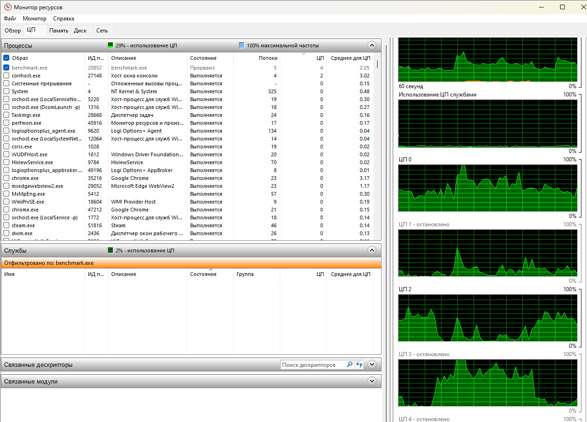

#### 2 загрузчика

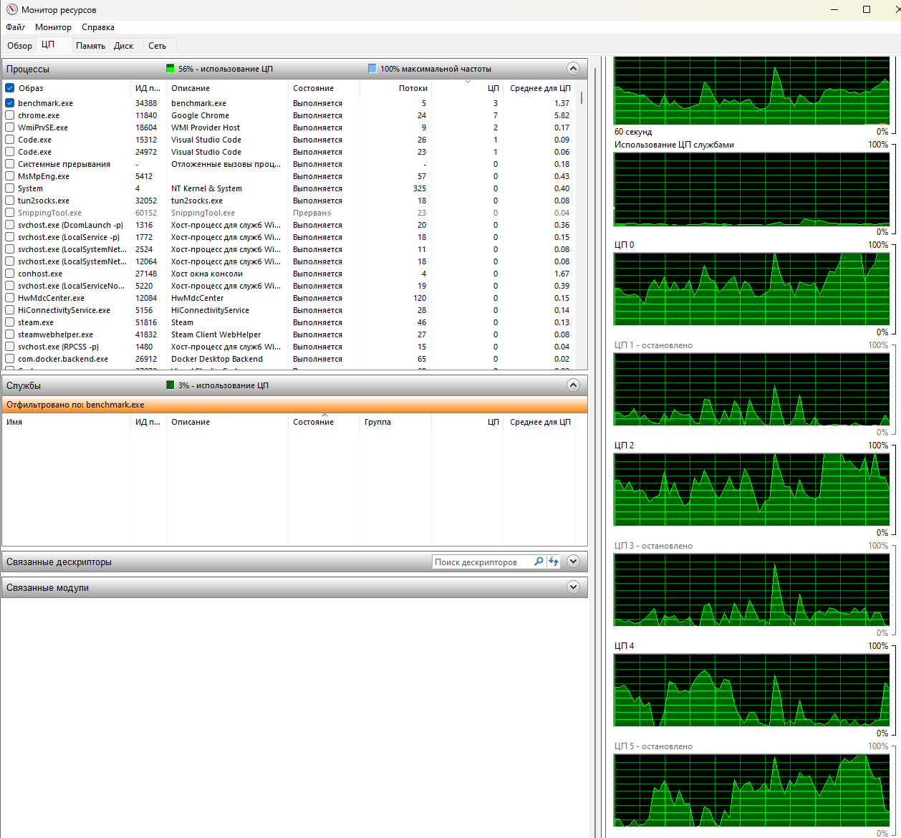
